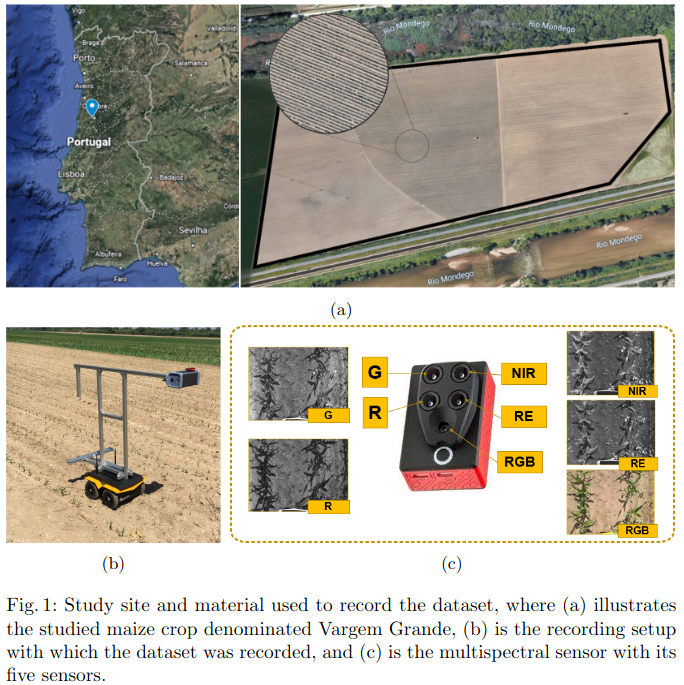
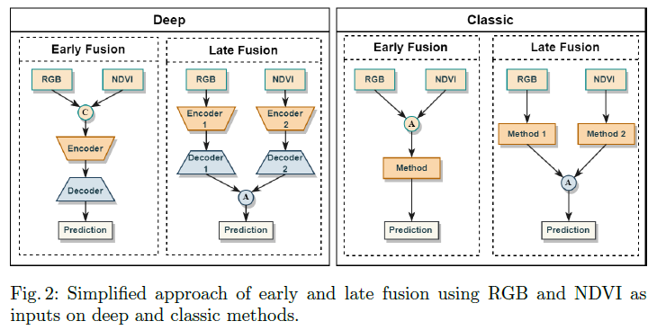
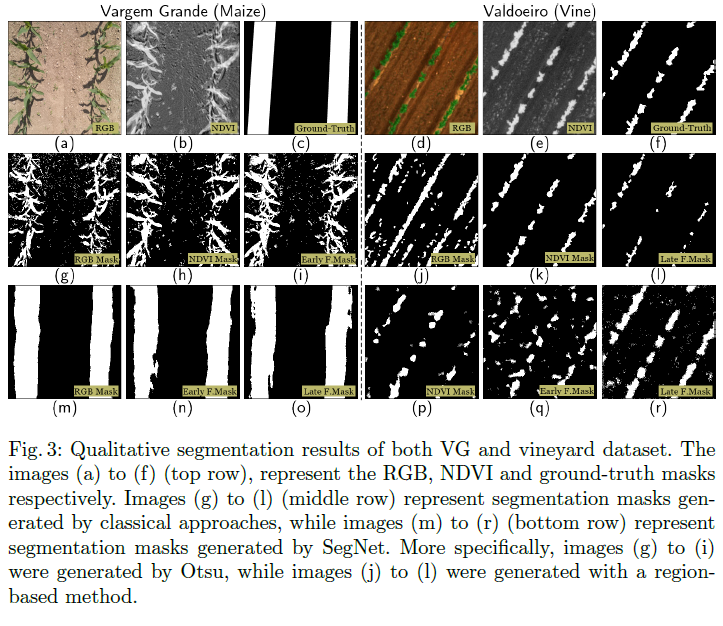

# Multispectral Image Segmentation in Agriculture: A Comprehensive Study on Fusion Approaches

This repository contains the code developed for the studies presented in the paper:
[Multispectral Image Segmentation in Agriculture: A Comprehensive Study on Fusion Approaches](https://link.springer.com/chapter/10.1007/978-3-031-59167-9_26).

In this work, we explore and compare various fusion strategies that combine RGB and NDVI inputs for crop row and vine segmentation.
The study evaluates both classical and deep learning-based segmentation approaches, demonstrating the strengths of late fusion techniques and the continued relevance of traditional methods in precision agriculture.

## Dataset #1 - Vargem Grande

  
   
  <em></em>

## Dataset #2 - Vineyards (referred to as Vine in project folders)

This dataset merges data from three distinct vineyard sources: Valdoeiro, Quinta de Baixo, and ESAC.

It was first introduced in the following publication:

[Multispectral vineyard segmentation: A deep learning comparison study](https://www.sciencedirect.com/science/article/abs/pii/S0168169922000990).

To get the datasets, please send an e-email to tiagobarros@isr.uc.pt

## Fusion Approaches

  
   
  <em></em>

## Image Examples and Some Qualititive Results

  
   
  <em></em>

## Requirements:

• torch

• torchvision

• numpy

• pillow

• scikit-learn

• tqdm

• matplotlib

• visdom 

## Official repository of the paper
https://github.com/Cybonic/MISAgriculture

